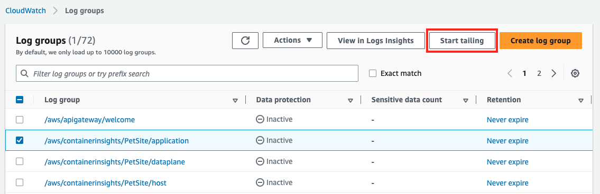

You can access the `Live tail` feature directly from the AWS CloudWatch console menu on the left, under the `Logs` section. From here you can select the log group and, optionally, the specific log stream to include in your tail session.

You can also start a live tail session from a specific log group:

1. Click on `Log groups` under the Logs section on the left navigation menu
2. Select the checkbox for the Log group `/aws/containerinsights/PetSite/application`, the `Start Tailing` button becomes available
3. Click on `Start Tailing` button



Note

To initiate a live tail session for a specific log stream within a log group, follow these steps:

1. Click on `Log groups` under the Logs section on the left navigation menu
2. Click on the name of a Log Group
3. Scroll down to the Log streams tab, and click on the name of a log stream.
4. Click on the `Start Tailing` button


When the Live Tail console starts, and you click on the `Filter` icon, you will be presented with the Filter configuration panel expanded showing the following available filtering options:

![Screenshot of the Live Tail console with filter|603x273](![[image-21.png]]

1. Select a log group - this is pre-populated if the first method was used. To start tailing the live events, at least one log group must be selected. All other input fields and primary buttons will be enabled only after the log group selection is made. For this workshop, ensure the log group named `/aws/containerinsights/PetSite/application` is selected.
2. Select log streams \[optional\] - this option is only available when a single log group is selected. It is disabled when more than one log group is selected. If no selection is made, all log streams in the selected log group will be included. There are two ways to find a log stream:
	- By Name - click on the dropdown to see a list of the log streams and select individually, or, type a name to search and select.
	- By Prefix - Log Streams can be selected based on a common prefix.
	For this workshop lets leave this filter empty to all log streams are included.
3. Add filter patterns \[optional\] - this option is case sensitive and allows to filter based on the content of the messages in the selected log groups and log streams. For this workshop, use this value to retrieve only the logs from the `petsite` container:
	```
	{ $.kubernetes.container_name = "petsite" }
	```
Note

Learn more about [filter patterns](https://docs.aws.amazon.com/AmazonCloudWatch/latest/logs/FilterAndPatternSyntax.html#matching-terms-events)

Start tailing - once the desired filtering criteria is made, click `Apply filters` to start the tailing session and display the latest live events as they are streaming into AWS CloudWatch Logs

[

## Console buttons and options

](https://catalog.us-east-1.prod.workshops.aws/event/dashboard/en-US/workshop/aws-native/logs/setup/#console-buttons-and-options)

You can enter up to 5 terms to be highlighted in the tail session. Terms are **not case sensitive** and you'll see it in the tail window session. Type each one of the following words followed by Enter (don't separate with spaces):

`dns` `udp` `recorder` `log` `failed`

, however, they may be more interested in the error code of `HTTP 504` (highlight term).

Sampling (xx events/s, % displayed) - When the number of events per second streamed to the console is at an acceptable rate, the ‘events/s’ number will reflect the actual number of filtered events and ‘% displayed’ will show 100%. However, if the volume of events is higher than expected, a percentage of events may be dropped. For example, sampling rate of ‘100 events/s, 60% displayed’ indicates that 167 filtered events were available but 100 (max rate) were streamed to the console and the remaining 67 were dropped.

Note

The dropped log events are discarded from the Live Tail console only, but continue to being processed and saved to CloudWatch Logs.

[

## Events Window


![[image-25.png]]

Displays the streaming events and enables you to pause and view the details of an event by clicking anywhere within the Events Window. Once the events flow is paused, clicking on the `Resume session` button (lower right corner) will immediately display the latest live events.

Click `Cancel` to stop the trailing of events.